# CDM-Telematics compiled wiki pages

_Self-contained version with local images_

## Version

This document was generated on 2025-11-07 19:42:28 UTC

---
# Operational entities

## Purpose

This diagram contains the main classes used for describing operations. Their scope is not necessarily restricted to the TAF TSI scope: for instance, containers (assets) and their "freight load" role (when loaded on a wagon) are described.

## Presentation

The left part (colored classes) shows the DUL (DOLCE+DnS Ultralite) concepts underpinning the model. The rest represents the taxonomy that is specific to the CDM-TAF ontology (with top concepts to the right).

Next to the right of the DUL classes are the classes describing our domain (operations). Their names should sound familiar.

Then, further right, are the superclasses (grouping our domain classes). They will mostly be ignored by users.

Details are provided in subsequent pages.

## About "DOLCE + DnS Ultralite" (DUL)

[DUL](https://akswnc7.informatik.uni-leipzig.de/dstreitmatter/archivo/ontologydesignpatterns.org/ont--dul--DUL--owl/2021.06.07-182648/ont--dul--DUL--owl_type=pyLodeDoc.html) is an "upper ontology" defining very general concepts (physical object, role, description...). It is suitable for describing domains mixing assets, processes, and all sorts of "social constructions", all of them possibly time-dependent.

End users can safely ignore this upper ontology. It is however useful for those who wish to understand, maintain, or extend the CDM-TAF ontology, since it contributes to separation of concerns and consistent design patterns.

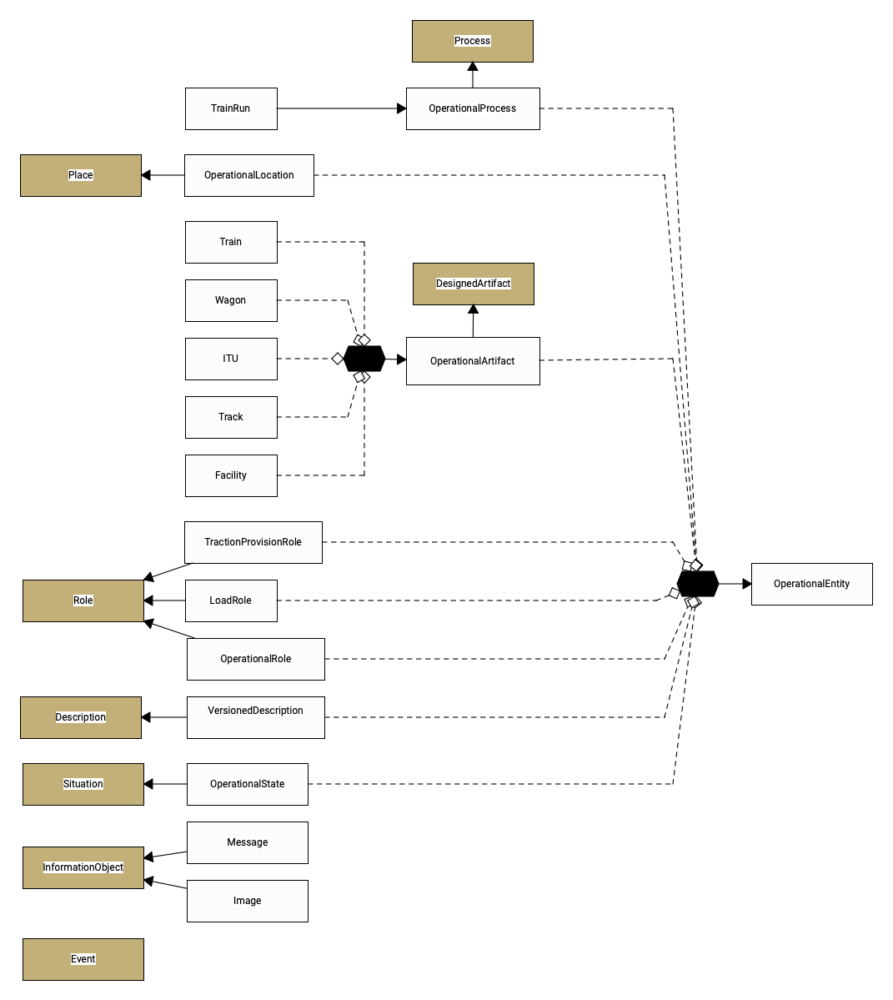

## Comments on the diagram

### GRAPHOL conventions

GRAPHOL is able to represent all OWL2 elements and relationships graphically. The graphs may evoke E/R or UML diagrams, but there are significant differences resulting from the very principles of ontologies.

#### Classes and subclasses

Square boxes represent classes (sets of individuals).

The graph A -> B means "A is included in B". When A and B are classes (which is the case here), this means "A is a subclass of B".

Keep in mind that ontology classes are sets, rather than types (as would generally be the case in object-oriented programming). All set operations, such as intersection, union, or complement, hence apply to ontology classes.

#### Disjoint unions

A black, flattened hexagon means "disjoint union of" whatever classes are attached to the hexagon by dashed lines.

For instance, Train, Wagon, Intermodal Transport Unit, Track, and Facility, are bundled into an anonymous "disjoint union". This implies that e.g. a Train cannot at the same time be a Wagon, etc.

This anonymous, disjoint union is a subclass of "Operational artifact" (did you notice the direction of the arrow?). This means that "operational artifact" contains (or includes) the mutually disjoint Train, Wagon, etc. classes, _and possibly could include other classes not mentioned here_, because out of scope.

Original page: [01-‐-Operational-entities.md](https://github.com/UICrail/CDM-Telematics/wiki/01-%E2%80%90-Operational-entities)

---
# Entity details

## Purpose

Operational entities may all share time-independent properties (attributes), which are described here.

## Diagram

For the time being, a user-defined "name" is proposed. It is not unique (one entity may have several names; different entities can have the same name as the "name" is a vernacular, not an identifier.

## Comments

The universally unique identifier is expected to be the entity IRI. IRIs are the foundations of the Semantic Web.

_Note: one reason for introducing the "name" property is that annotation properties (such as rdfs:label) that would play this role are left out of OWL to JSON transformers (CIM or PIM to PSM)._

Original page: [01a-‐-Entity-details.md](https://github.com/UICrail/CDM-Telematics/wiki/01a-%E2%80%90-Entity-details)

---
# Train run

## Purpose

"Train run" (commonly "train", in an operational context) designated a train (characterized by a train number) running on a particular day. It is what a dispatcher has to manage, not to be confused with:
* "train" as a railway timetable entry;
* "train" as a set of railway vehicles, some of which are powered.

The expression "train run" was chosen because it best evokes the train as a process.

The equivalent class in the ERA TAF ontology is [Train](http://data.europa.eu/949/Train).

## Diagram

### Description

The GRAPHOL diagram is centered on the "Train run" class that has a set of static properties (on the right) and time-dependent states (on the left).

The static properties are directly derived from the Telematics TSIs and ontology, e.g. OTN (Operational Train Number).

The train states are further described in another diagram.

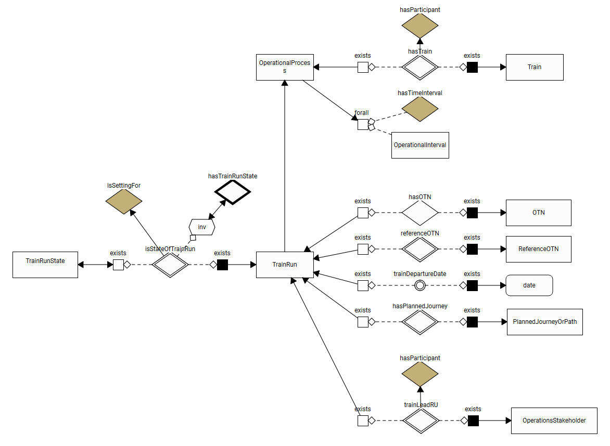

### Comments

#### GRAPHOL representation of properties

In GRAPHOL, object properties are represented by diamonds. Their name often starts with "has", but this is a convention, not a rule.

Object properties are displayed as class A <-[white square] - <Property P> - [black square] -> class B, meaning P(A, B), i.e. individuals of A are related to individuals of B by a property named P. Example: some Train (subject) has a train operating RU (predicate) some Train operator (object).

Diamonds with a double-edged rim denote "functional properties". In OWL2, a functional property is such that any subject will be associated with at most one object. Inverse functional properties have a thick black rim, and properties that are both functional and inverse functional have a double-edged rim on one side and a thick black rim on the other side.

When the property objects are data types (such as strings, integers, timestamps...), the property is called a "data property" in OWL2. It is represented by a small circle, as is the case here with "train departure date". The double rim also means functional [data] property.

Note: in OWL2, object properties can be navigated in both directions, no matter if the inverse property is defined (as is the case here for "is state of train run") or not. Data properties are however one way (they have no inverses). Of course the end user can _query_ OWL2 data to find, e.g., "all train runs occurring today", but the logics underpinning OWL2 ontologies (and executed by reasoners such as Pellet or HermiT) cannot achieve that.

#### OWL2 Subproperties

In OWL2, properties are first-class objects; there are subproperties as there are subclasses. The semantics of "sub" is inclusion, and the symbol for inclusion is the simple arrow in both cases. Explanation:

* for classes: class A is a subclass of class B iff (= if and only if) any individual of A is also an individual of B.
* for properties: property P is a subproperty of property Q iff for any individuals X and Y satisfying P(X,Y), Q(X,Y) also holds.

The interest of defining subproperties is mainly a semantic one. Example: "empty mass" or "laden mass" are subproperties of "has mass", meaning that the expected value is a mass expressed in, say, kg, but their meaning and relevance is quite precise.

In the present case, the subproperty arrow links the general-purpose dul:isSettingFor property with its specialization, "is state of train run".

#### Train run states relate to exactly one train run

This is partly expressed by property "is state of train run" being a functional property. "Functional" implies 0 or 1 object.

A train run _state_ however is expected to describe exactly one train run, as common sense dictates, not "at most one".

Enforcing such cardinality "exactly one object" is possible and is done elsewhere, and in various ways (using OWL2 or SHACL constraints; using an explicit cardinality or an existential condition). Here, we chose to represent "at most one" by using a functional property, and "at least one" by stating an existential condition ("Train run state" is a subclass of all things X satisfying "X is the state of some train run"). The condition can be read from the diagram.

#### A train run involves one train

... although its composition and loads may change between origin and destination. See the Train-related wiki page.

#### Where are the train origin and destination?

The train destination may change in the course of the train run (think of a re-routed train). This is why the train journey (planned, foreseen, actual...) are time-dependent, and documented using 

#### About OWL2 profiles

Explicit cardinalities (min=1, max=1) would look nicer, but are avoided here for technical reasons. We try to stick to a subset of OWL2, namely the OWL2 RL profile, to secure the tractability of queries in polynomial time.

Original page: [02-‐-Train-run.md](https://github.com/UICrail/CDM-Telematics/wiki/02-%E2%80%90-Train-run)

---
# Train servicing

## Purpose

What happens when trains do not run is equally important for managing operations. Servicing at the origin, at destination, or at intermediate stops, can be described as more processes which can only take place if a train runs.

## Diagram

The "train run" is therefore the main operational process, and its sub-processes are of type "train service".

A train service has a "setting" (in the sense of DUL) which can be understood as a "circumstance", and this is a "static section" of the train journey.

_Note: This is a slight over-simplification, since passenger trains for instance sometimes benefit from cleaning processes while running. _

A "static section" of a journey is any part of the journey where the train stops and/or starts, so there is a time interval where it is supposed to be static, hence the name. Details are provided in [the Journey Schedule page](https://github.com/UICrail/CDM-Telematics/wiki/12b-%E2%80%90-Journey-Schedule).

_Note: a "static section" may include shunting movements (FR: manoeuvres et évolutions)._

Finally, the train service must be of at least one type, such as "maintenance" or "customs".

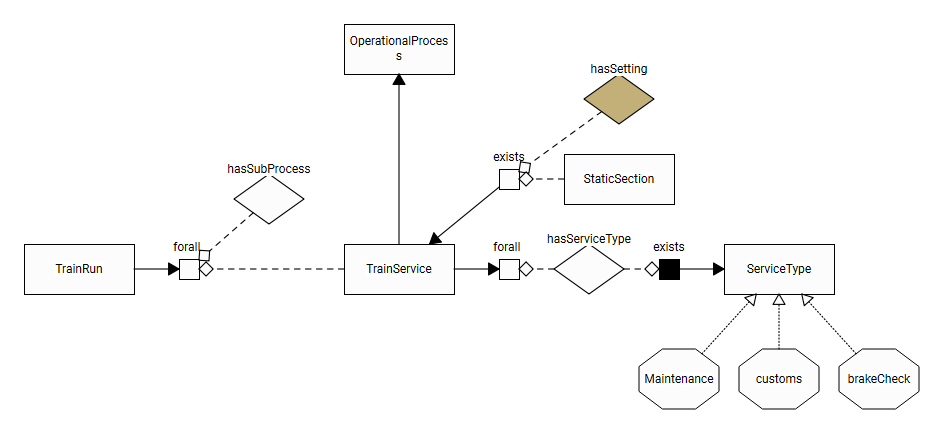

## Comments

### False simplifications = True mess

The user is free to define distinct services or a single combined one, but the latter option is not recommended (customs clearance may be provided while some maintenance operations may need to be delayed): what may first appear as a simplification may result in a mess.

Original page: [02a-‐-Train-servicing.md](https://github.com/UICrail/CDM-Telematics/wiki/02a-%E2%80%90-Train-servicing)

---
# Operational Location

## Purpose

Defining primary and subsidiary location codes. Locating fixed assets (tracks, facilities) at the places designated by these codes.

## Diagram

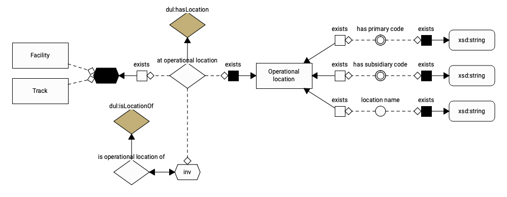

## Comments

### Property "at operational location"

This property only applies to (= has range) spatially fixed assets such as station tracks, facilities (yards, depots, stations, terminals). There is no time information attached to it.

Please note that a yard _has_ a location; a yard _is not_ a location. This confusion often occurs because a yard happens to be a fixed thing. The confusion never occurs with moving things. In the present ontology, fixed and moving things are treated homogeneously, so fixed things are not assimilated to their location.

### So where are moving things located at time t ?

The answer lies in the dul:Situation class and its subclasses (generally called "... status" in the present ontology). dul:Situation is the class where time-dependent information is asserted.

Original page: [03-‐-Operational-Location.md](https://github.com/UICrail/CDM-Telematics/wiki/03-%E2%80%90-Operational-Location)

---
# Train

## Purpose

The "Train" class designates the physical object (here: dul:DesignedArtefact) that is moved in the process of running a train, the "Train run". That includes not only the rolling stock (considered in running order, with all supplies included), but also the loaded freight and (with a minus sign) the spent fuel or sand.

### Diagram

The composition of the Train varies between Journey Segments (where wagons can be added or removed, locomotives can be changed, etc.). We choose to consider that for each particular train run, we have a single train (i.e. a single individual of class Train) with variable composition and loads. This choice best coincides with the way people speak.

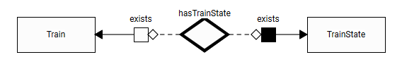

Original page: [04-‐-Train.md](https://github.com/UICrail/CDM-Telematics/wiki/04-%E2%80%90-Train)

---
# Wagon

## Purpose

## Diagram

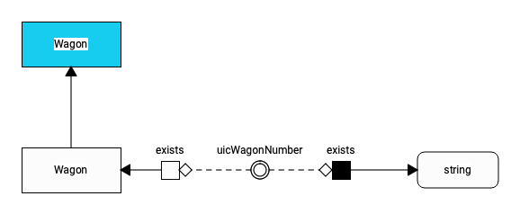

## Comments

Original page: [05-‐-Wagon.md](https://github.com/UICrail/CDM-Telematics/wiki/05-%E2%80%90-Wagon)

---
# Intermodal Transport Unit

## Purpose

## Diagram

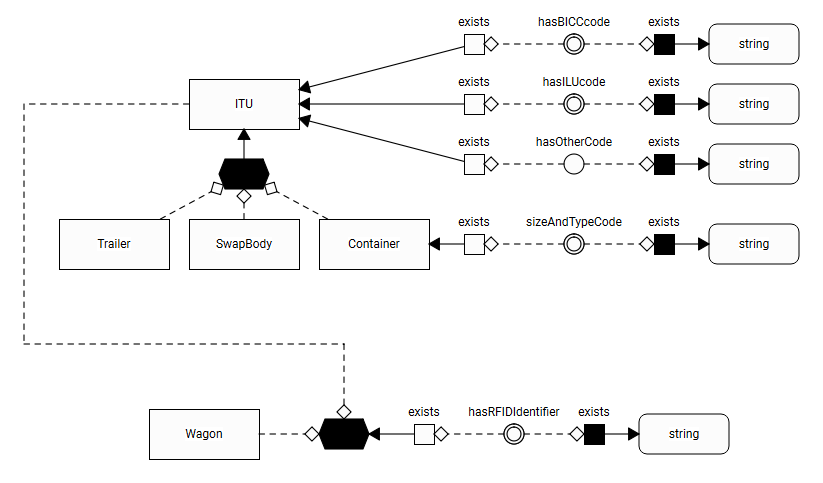

## Comments

Original page: [06-‐-Intermodal-Transport-Unit.md](https://github.com/UICrail/CDM-Telematics/wiki/06-%E2%80%90-Intermodal-Transport-Unit)

---
# Cargo

## Purpose

## Diagram

## Comments

Original page: [06a-‐-Cargo.md](https://github.com/UICrail/CDM-Telematics/wiki/06a-%E2%80%90-Cargo)

---
# Track

## Purpose

## Diagram

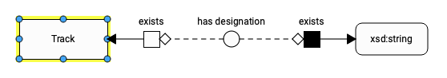

## Comments

Original page: [07-‐-Track.md](https://github.com/UICrail/CDM-Telematics/wiki/07-%E2%80%90-Track)

---
# Facility

## Purpose

## Diagram

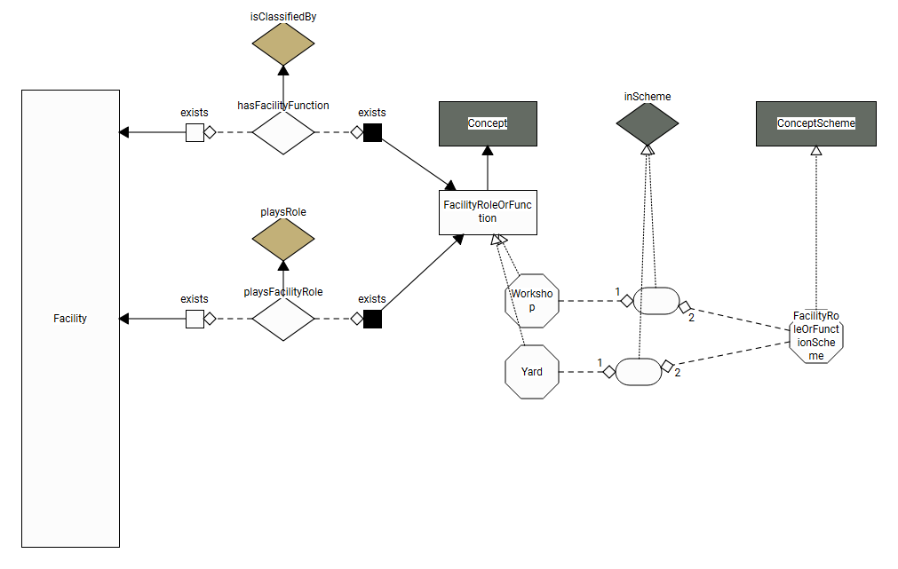

## Comments

Original page: [08-‐-Facility.md](https://github.com/UICrail/CDM-Telematics/wiki/08-%E2%80%90-Facility)

---
# Traction role

## Purpose

## Diagram

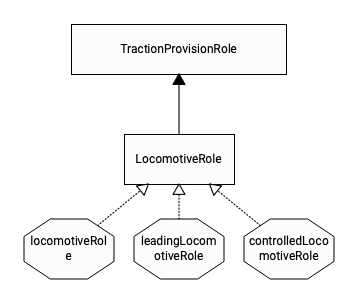

## Comments

Original page: [09-‐-Traction-role.md](https://github.com/UICrail/CDM-Telematics/wiki/09-%E2%80%90-Traction-role)

---
# Load Role

## Purpose

## Diagram

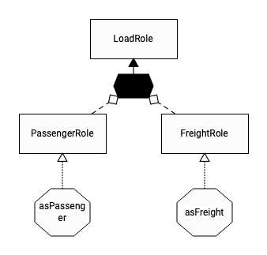

## Comments

Original page: [10-‐-Load-Role.md](https://github.com/UICrail/CDM-Telematics/wiki/10-%E2%80%90-Load-Role)

---
# Operational roles

## Purpose

Companies may play different operational roles at different times. Examples of operational roles are: Train operator, Cargo carrier, Lead RU, Lead carrier (the latter is encountered in the TAF TSI). 

## Diagram

Operational roles are currently listed as members of class OperationalRole. In the future, these may be replaced by a SKOS concept scheme provided by ERA.

The answer to "who plays the role" is outside this ontology. Such companies are by definition subclasses of dul:Organization and regorg:RegisteredOrganization.

dul:Organization tells that its members are able to play a role. regorg:Organization provides lots of useful attributes (legal name, jurisdiction, registration authority, etc.). The W3C [REGORG ontology](https://www.w3.org/TR/vocab-regorg/) is based on the W3C ORG ontology and is recommended for use by the EC (see [this ontology collection item](https://interoperable-europe.ec.europa.eu/collection/registered-organization-vocabulary) and [this announcement page](https://interoperable-europe.ec.europa.eu/collection/semic-support-centre/news/w3c-publishes-two-specificati) from the Interoperable Europe Portal.

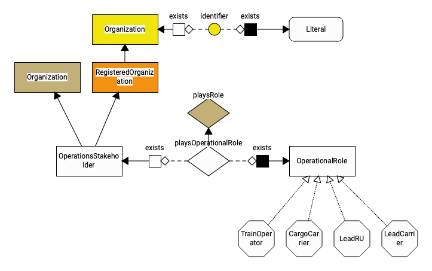

## Comments

### No dedicated class for organizations - just a blank node

We simply use a "blank node" (a class without a name) that is the intersection ("and") of dul:Organization and rerorg:RegisteredOrganization.

What the diagram expresses (and what OWL2 says) is that anything that plays an operational role in the context of telematics is, by definition, both a dul:Organization (hence not a person) and a rerorg:Organization (with some or all of the foreseen properties provided by RERORG).

Original page: [11-‐-Operational-roles.md](https://github.com/UICrail/CDM-Telematics/wiki/11-%E2%80%90-Operational-roles)

---
# Versioned description

## Purpose

## Diagram

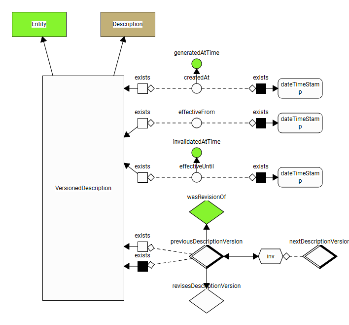

## Comments

Original page: [12-‐-Versioned-description.md](https://github.com/UICrail/CDM-Telematics/wiki/12-%E2%80%90-Versioned-description)

---
# Journey

## Purpose

## Diagram

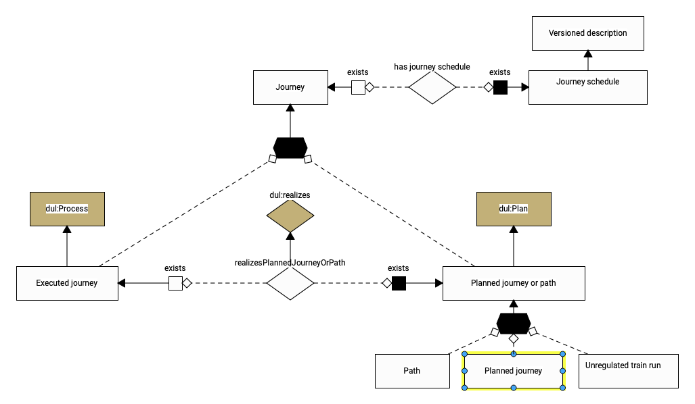

## Comments

Original page: [12a-‐-Journey.md](https://github.com/UICrail/CDM-Telematics/wiki/12a-%E2%80%90-Journey)

---
# Journey Schedule

## Purpose

Represent the train journey (planned or executed) and possibly the train path in one uniform way.

The Journey may be composed of a sequence of journey sections, each having an origin and a destination (operational locations). Obviously, the destination of section N is expected to also be the origin of section N+1, and times must be increasing (except when midnight is passed).

## Diagram

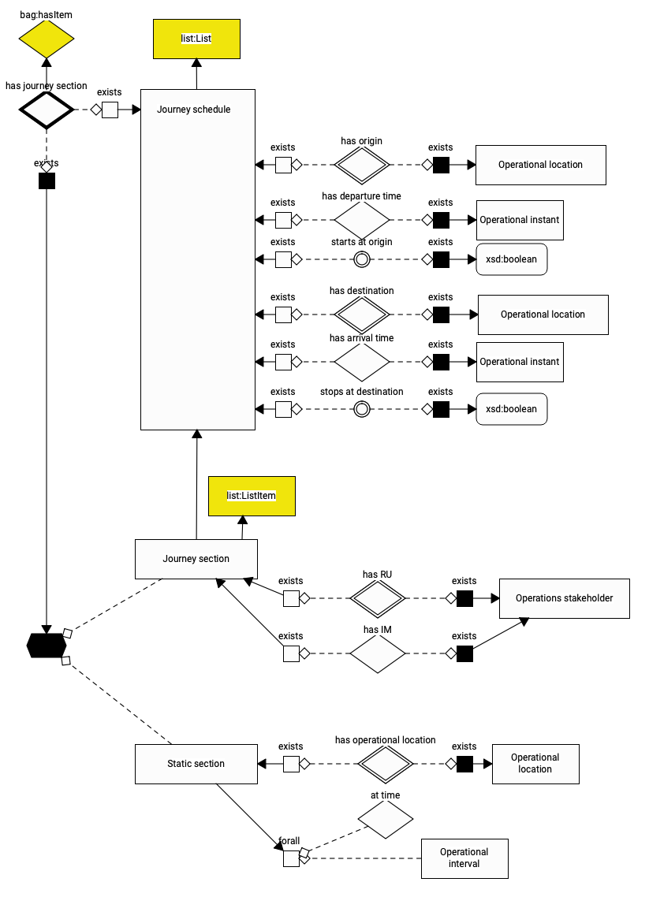

## Comments

### Nested Lists

Since any Journey section is a Journey schedule, it can be in turn broken down. This is convenient, as it allows to insert pass-through locations at a later stage when deemed convenient.

### Not a speed profile

Locations documented by Journey Schedule are, for the time being, only Operational Locations. The Journey Schedule is not suitable for representing a speed profile with temporary speed restrictions for instance.

### Data consistency

It is a user responsibility to check the order and consistency of journey sections. The ontology will preserve the sequence (using a List ontology, because OWL2 has no primitive concepts for order), but whether the sequence _makes sense_ must be checked by other means, such as SWRL rules, or queries (possibly embedded in SHACL), etc.

### List ontology

The List ontology used here is different from the one used in IfcOwl (the ontology version of Industry Foundation Classes). Later on, one of the two ontologies may be eliminated in favor of the other.

Original page: [12b-‐-Journey-Schedule.md](https://github.com/UICrail/CDM-Telematics/wiki/12b-%E2%80%90-Journey-Schedule)

---
# Journey Schedule properties

## Purpose

Properties are made available by the List ontology that allow to "chain" and navigate the Journey Sections. Some are illustrated here.

## Diagram

Journey sections are chained with no branches and no loops. This is expressed by having properties (next section, previous section) that are both functional and inverse functional: the diamonds have both a double rim (functional, multiplicity 0..1) and a thick black rim (inverse functional, multiplicity 0..1).

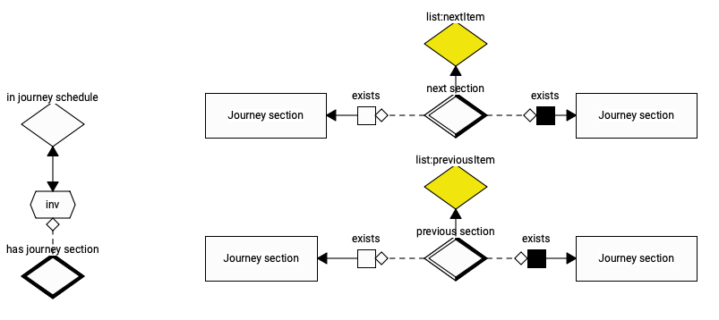

On the left, you see the GRAPHOL representation of the OWL2 assertion: "in journey schedule" is the exact equivalent (double arrow!) of the inverse of "has journey section".

_Note: since "in journey schedule" is the inverse of an inverse functional property, it consequently is a functional property. The diagram does not declare it (simple rim instead of double rim) but OWL2 reasoners will infer it._

## Comments

(about the identification of the first and last item)

Original page: [12c-‐-Journey-Schedule-properties.md](https://github.com/UICrail/CDM-Telematics/wiki/12c-%E2%80%90-Journey-Schedule-properties)

---
# Operational State

## Purpose

Describe time-dependent attributes (properties) that are relevant to operations: train run state ("where is my train?"), train state ("what is the train composition?"), load state ("on which wagon is my container?"), etc.

## Diagram

"Operational state" is the topmost class, on which the time-dependency hinges. Time can be expressed as an instant or as an interval.

Time instant suggests that the state is actually a state change, valid until the next, or a spot measurement ("is my train at rest?").

Time interval suggests that the state extends over the interval, or maybe the state change.

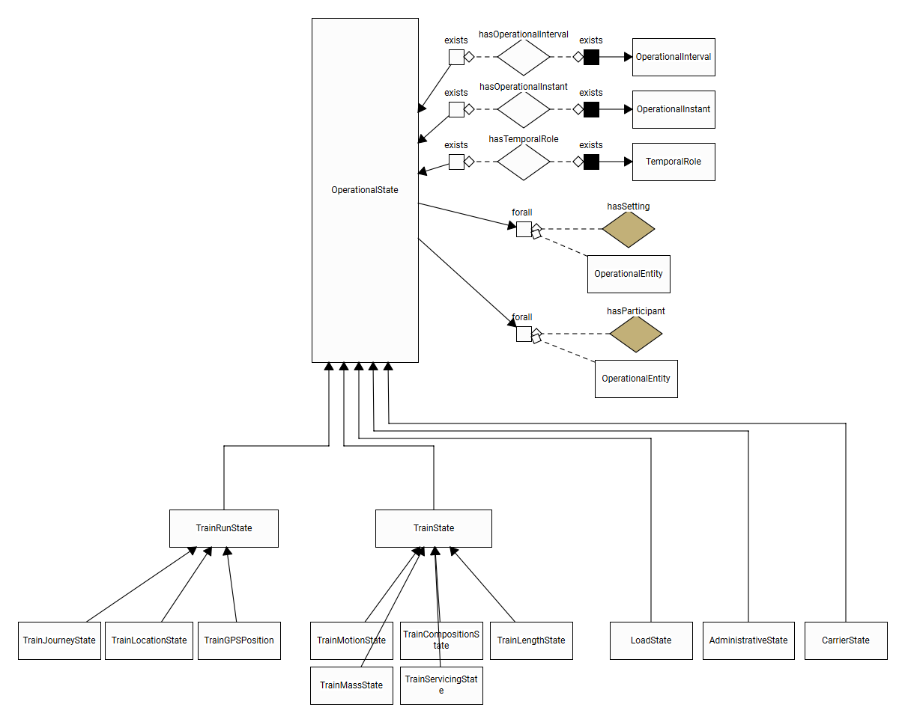

## Comments

### Restriction on property dul:hasTimeInterval

In our context we use the predefined property dul:hasTimeInterval but restrict its range to time:Interval (improper time interval in the W3C Time ontology) when it applies to an Operational State. This is exactly what the OWL2 restriction does. Note that the range of dul:hasTimeInterval is dul:TimeInterval, a very broad concept that may well encompass any time:Interval. We made this explicit in the 99-Varia diagram.

### Ambiguity to be lifted

The ambiguity state / state change should be removed at a later stage.

### Proper vs. degenerate intervals

All time-related classes are borrowed from the W3C Time ontology.

Time intervals can be bounded, or open-ended, or degenerate (start instant = end instant). Again, it would be useful to clarify when to use an instant and when to use a degenerate interval. One may consider using class ProperInterval (with end > start) and exclude degenerate intervals altogether.

Original page: [13-‐-Operational-State.md](https://github.com/UICrail/CDM-Telematics/wiki/13-%E2%80%90-Operational-State)

---
# Train run state

## Purpose

## Diagram

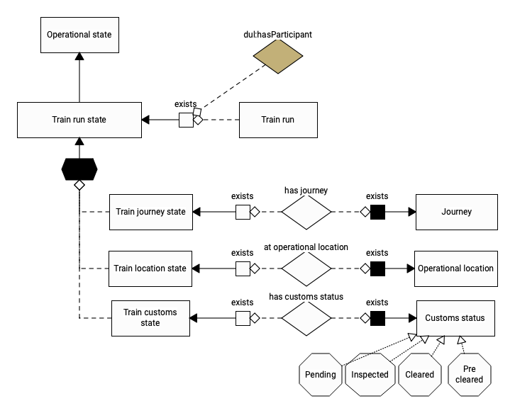

## Comments

Original page: [13a-‐-Train-run-state.md](https://github.com/UICrail/CDM-Telematics/wiki/13a-%E2%80%90-Train-run-state)

---
# Train state

## Purpose

## Diagram

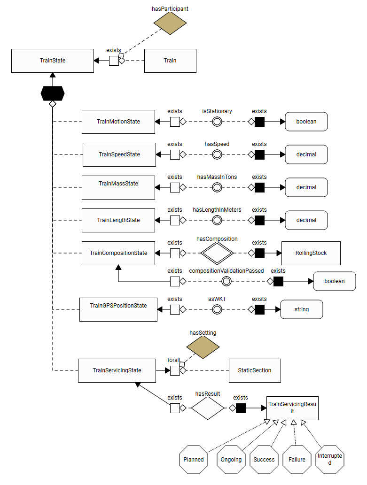

## Comments

Original page: [13b-‐-Train-state.md](https://github.com/UICrail/CDM-Telematics/wiki/13b-%E2%80%90-Train-state)

---
# Load State

## Purpose

## Diagram

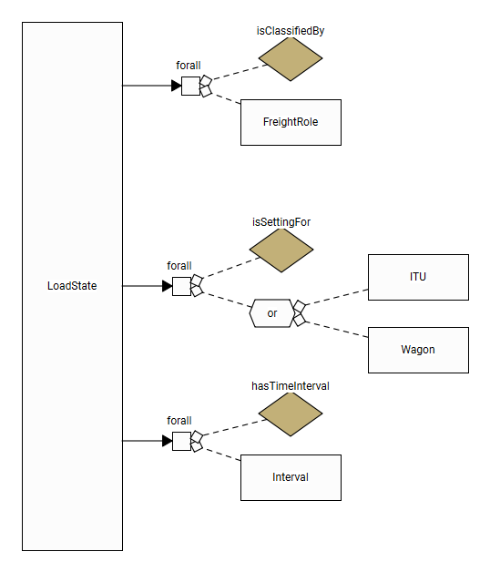

## Comments

Original page: [13c-‐-Load-State.md](https://github.com/UICrail/CDM-Telematics/wiki/13c-%E2%80%90-Load-State)

---
# Message

## Purpose

## Diagram

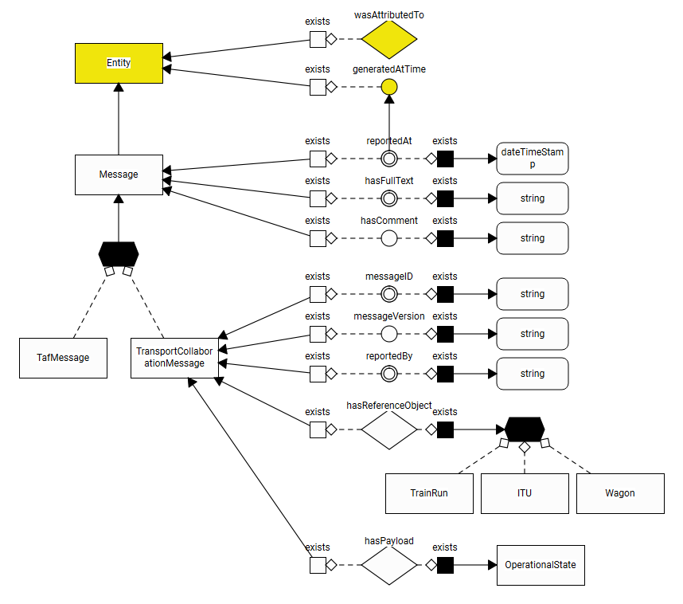

## Comments

Original page: [14-‐-Message.md](https://github.com/UICrail/CDM-Telematics/wiki/14-%E2%80%90-Message)

---
# Image

## Purpose

Provide a reference to images, and access image contents (e.g. a PNG file).

## Diagram

The image reference (URI) is separated from the contents (Content location, identified by its own URI). It is likely that they will not share the same workspace. Persistence and backup mechanisms are likely to be very different: e.g. images will require frequent archiving, owing to their "weight".

The content URI may be a URL (dereferenceable) or another type of URI if only a "unique key" in a specific database is needed.

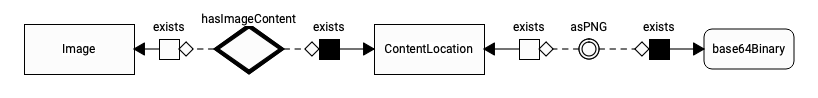

## Comments

### Metadata

Image metadata persistence (provenance...) is of course crucial and shall be discussed in due time.

Original page: [15-‐-Image.md](https://github.com/UICrail/CDM-Telematics/wiki/15-%E2%80%90-Image)

---
# RID codes

## Purpose

Add the information about dangerous goods and the resulting hazard classes, as per RID.

Information is defined in chapter 3.2 of the RID, Table A, columns 1 and 3a, respectively.

## Diagram

The information relates to the dangerous substance, but shall be affixed on the ITU or the wagon, as per chapter 5 of RID.

Accordingly, two properties are provided, the domain of which is the union of Wagon and ITU. This union is a disjoint one, since classes Wagon and ITU were declared disjoint (no wagon is an ITU, no ITU is a wagon); it is represented in GRAPHOL by a flattened black hexagon, with no name (hence a "blank node").

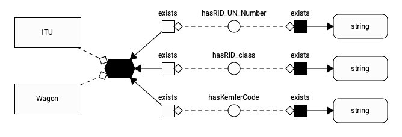

## Comments

Original page: [20-‐-RID-codes.md](https://github.com/UICrail/CDM-Telematics/wiki/20-%E2%80%90-RID-codes)

---
# Time

## Purpose

Propose "time entities" to be consumed by time-dependent entities (such as "train speed" or "custom clearance status").

The time entities are derived from the [W3C time ontology](https://www.w3.org/TR/owl-time/) and aligned with the DUL TimeInterval concept.

## Diagram

An operational time is either an instant or an interval: these are disjoint classes, as the black flattened hexagon indicates in the diagram. The distinction between instant and interval rests on semantics, not on timestamp values: an interval has a beginning and an end (whether or not the values are known), while an instant has a beginning (instant) and an end (instant). These may happen to coincide, i.e. have equal timestamp values.

The GRAPHOL diagram expresses that each interval is expected to have exactly one beginning and one end, by means of OWL universal restrictions ("forAll"), and that the beginning or end are of type "Operational instant".

_Note: if the data provide two beginnings for an interval, the logical consequence is that the beginnings B1 and B2 are the same individual (:B1 owl:sameAs :B2) and any OWL reasoner will infer that and inform the user accordingly. Then the user software may want to compare the respective timestamp values (OWL2 ignores them, so use SPARQL or code). If timestamps of B1 and B2 fail the test for equality (say, difference is more than one millisecond? which is context-dependent), then the user has detected an inconsistency and should consider resolving it. In a world of imperfect data, wrong data should not break the database. Ontologies, being robust against such data errors, are a suitable tool to represent them, but the onus of error detection is partly on the user: OWL2 has no numeric operators._

Operational times (instants or intervals) may have a "date and time of issue". This non-mandatory information is of interest in the case of repeated forecasting or revision exercises. The bulk of exchanged times, in an operational environment, is composed forecasts or revisions, so this "time property of time" is everything but ludicrous.

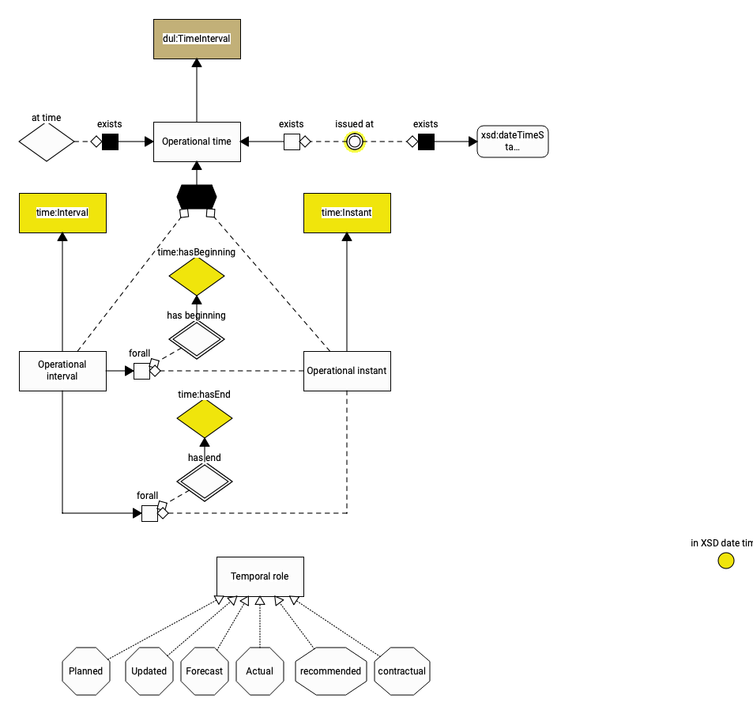

The bottom part (Temporal role class and individuals) add meaning to time-dependent situations, i.e. whether they relate to a planned, revised, forecast, actual, etc. situation (the DUL term) or state (our used term).

## Comments

### Real Time applications

The time representation is conceptually compatible with the [UML MARTE profile](https://www.omg.org/omgmarte/), so it can serve as a basis for a demanding real-time application. The main missing concept is that of Clock: we currently assume all clocks to be synchronized, so we ignore them altogether (there is no need for a Clock class).

We do not distinguish intervals from "proper intervals" (length > 0) in the sense of the W3C Time ontology: as no assumptions are made regarding the timestamps, if may well happen that the beginning and the end of an interval are distinct (in actual time), but have the same timestamp value. Calling it a "proper interval" would then be a semantic error.

### Against open-ended intervals

Leaving out the beginning or end of an interval _may_ be interpreted as the interval being "open-ended". We would like to sternly warn against such convention, since it breaks the monotonicity of time reasoning. Example: if a fire extinguisher has a usability interval but the end is missing from the available data, it shall not be understood as "usable forever", as this conclusion would immediately be falsified by the provision, at some stage, of the missing information.

In the context of railway applications, nothing is actually open-ended in time, and most data may be made available with some delay, so the "open ended" interpretation of any interval with missing data would be a gross mistake.

Original page: [90-‐-Time.md](https://github.com/UICrail/CDM-Telematics/wiki/90-%E2%80%90-Time)

---
# Varia

## Purpose

## Diagram

## Comments

Original page: [95-‐-Varia.md](https://github.com/UICrail/CDM-Telematics/wiki/95-%E2%80%90-Varia)

---
# Dependencies

## General and upper ontologies

### W3C Time ontology

### SOSA/SSN

### QUDT

### DOLCE+DnS Ultralite

### REGORG, ORG

## Semantic RSM ontologies

### Rolling stock ontologies

#### Consist

#### Typology

## ERA Concept Schemes

Original page: [97-‐-Dependencies.md](https://github.com/UICrail/CDM-Telematics/wiki/97-%E2%80%90-Dependencies)

---
# References

...

Original page: [99-‐-References.md](https://github.com/UICrail/CDM-Telematics/wiki/99-%E2%80%90-References)

